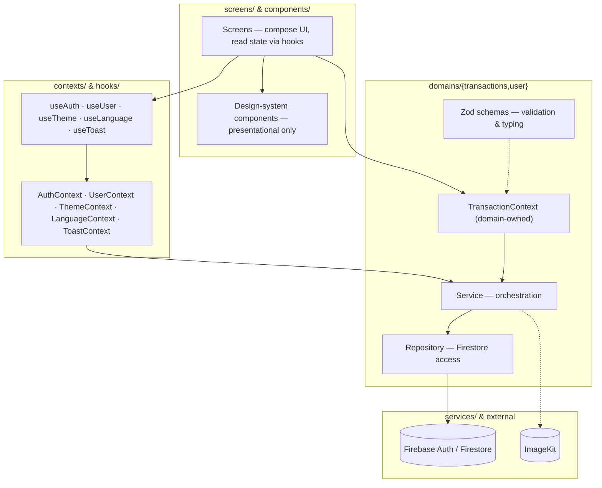
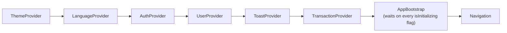

# uFinance

A personal finance tracker built with React Native and Expo — and, just as importantly, a hands-on capacitação (training project) in React Native and software architecture. uFinance exists to practice building a real, non-trivial mobile app end to end: authentication, a domain-driven data layer on top of Firestore, a small design system, theming, internationalization, and the everyday tradeoffs that come with structuring all of that so it stays understandable as it grows.

This README documents the project as it exists today: what it does, how to run it, and how it's put together.

## Table of contents

- [What it does](#what-it-does)
- [Tech stack](#tech-stack)
- [Getting started](#getting-started)
  - [Prerequisites](#prerequisites)
  - [Install](#install)
  - [Environment variables](#environment-variables)
  - [Run the ImageKit auth server](#run-the-imagekit-auth-server)
  - [Run the app](#run-the-app)
- [ImageKit and credential safety](#imagekit-and-credential-safety)
- [Architecture overview](#architecture-overview)
- [Project structure](#project-structure)
- [Contexts, hooks, services, repositories, components](#contexts-hooks-services-repositories-components)
- [Core features, in depth](#core-features-in-depth)
  - [Authentication](#authentication)
  - [User domain](#user-domain)
  - [Transactions domain](#transactions-domain)
  - [Firestore persistence](#firestore-persistence)
  - [Image upload with ImageKit](#image-upload-with-imagekit)
  - [Light/dark theme](#lightdark-theme)
  - [Internationalization (pt-BR / en-US)](#internationalization-pt-br--en-us)
  - [Navigation](#navigation)
  - [Design system](#design-system)
  - [Forms and validation](#forms-and-validation)
- [Key architectural decisions](#key-architectural-decisions)
- [Decisions considered and abandoned](#decisions-considered-and-abandoned)
- [Known limitations & things to know before running](#known-limitations--things-to-know-before-running)
- [Possible next steps](#possible-next-steps)
- [License](#license)

## What it does

uFinance lets a signed-in user track their personal finances: log income and expense transactions with a category, amount, date and optional description; see a dashboard with their current balance, a monthly income/expense summary and their most recent transactions; browse and filter the full transaction list; edit their profile (name and photo); and choose their preferred appearance (light/dark/system) and language (Portuguese/English/system) from a Settings screen.

| Area | What's implemented |
|---|---|
| Authentication | Email/password sign up, sign in, sign out, persisted session |
| Profile | View/edit name, upload/change profile photo |
| Transactions | Create, list, edit, delete income/expense transactions |
| Categories | 5 income categories, 9 expense categories |
| Dashboard | Current balance, monthly income vs. expense summary, recent transactions |
| Filtering | Filter the transaction list by type and date range |
| Theme | Light / dark / follow-system, persisted across launches |
| Language | Portuguese (pt-BR) / English (en-US) / follow-system, persisted across launches |
| Feedback | Toast notifications for success/error states |

## Tech stack

| Layer | Choice |
|---|---|
| Framework | [Expo](https://expo.dev) (SDK ~54) on React Native 0.81 / React 19, New Architecture enabled |
| Language | TypeScript, `strict` mode |
| Navigation | [React Navigation](https://reactnavigation.org) — native stack + drawer (not Expo Router) |
| Backend | [Firebase](https://firebase.google.com) — Authentication and Firestore |
| Media/CDN | [ImageKit](https://imagekit.io) for profile photo storage, with a small local Express server for signed uploads |
| Forms & validation | [react-hook-form](https://react-hook-form.com) + [Zod](https://zod.dev) (transactions), plain hand-written validation (auth screens) |
| Local persistence | `@react-native-async-storage/async-storage` — theme/language preference, Firebase Auth session |
| i18n | [i18next](https://www.i18next.com) / [react-i18next](https://react.i18next.com) + `expo-localization` |
| Icons / fonts | [lucide-react-native](https://lucide.dev), Inter (`@expo-google-fonts/inter`) |
| Feedback | `react-native-toast-message` |

## Getting started

### Prerequisites

- Node.js (an LTS version) and npm
- The [Expo Go](https://expo.dev/go) app on a physical device, or an Android/iOS simulator
- A [Firebase](https://console.firebase.google.com) project with **Authentication** (email/password provider) and **Firestore** enabled
- An [ImageKit](https://imagekit.io) account, for profile photo uploads

### Install

```bash
git clone https://github.com/Dobravoski/uFinance.git
cd uFinance
npm install
```

### Environment variables

The project uses two separate `.env` files: one for the Expo app (client-safe values only) and one for the small ImageKit auth server (which holds the one secret in the project).

**Root `.env`** — copy `.env.example` to `.env` and fill it with your Firebase and ImageKit project details:

```bash
cp .env.example .env
```

| Variable | Where it's used |
|---|---|
| `EXPO_PUBLIC_FIREBASE_API_KEY` | Firebase Web app config |
| `EXPO_PUBLIC_FIREBASE_AUTH_DOMAIN` | Firebase Web app config |
| `EXPO_PUBLIC_FIREBASE_PROJECT_ID` | Firebase Web app config |
| `EXPO_PUBLIC_FIREBASE_STORAGE_BUCKET` | Firebase Web app config |
| `EXPO_PUBLIC_FIREBASE_MESSAGING_SENDER_ID` | Firebase Web app config |
| `EXPO_PUBLIC_FIREBASE_APP_ID` | Firebase Web app config |
| `EXPO_PUBLIC_IMAGEKIT_URL_ENDPOINT` | Your ImageKit URL endpoint |
| `EXPO_PUBLIC_IMAGEKIT_PUBLIC_KEY` | Your ImageKit **public** key |
| `EXPO_PUBLIC_IMAGEKIT_AUTHENTICATION_ENDPOINT` | URL of the auth server below (its `/auth` route) |

All of these are read in `src/config/env.ts`, which throws immediately at startup if any of them is missing — there's no silent fallback.

**`server/.env`** — copy `server/.env.example` to `server/.env` and fill in your ImageKit keys:

```bash
cp server/.env.example server/.env
```

| Variable | Where it's used |
|---|---|
| `IMAGEKIT_PRIVATE_KEY` | Your ImageKit **private** key — server-side only, never shipped to the app |
| `IMAGEKIT_PUBLIC_KEY` | Your ImageKit public key |

### Run the ImageKit auth server

Profile photo upload needs this running (see [ImageKit and credential safety](#imagekit-and-credential-safety) for why):

```bash
npm run server
```

This starts an Express server on port `3000`. Make sure `EXPO_PUBLIC_IMAGEKIT_AUTHENTICATION_ENDPOINT` in the root `.env` actually points to a URL your app can reach — `localhost` only works if the app itself is running on the same machine (e.g. a simulator); a physical device running Expo Go needs your machine's LAN IP instead (e.g. `http://192.168.x.x:3000/auth`).

### Run the app

```bash
npm start          # Expo dev server — scan the QR code with Expo Go, or pick a platform
npm run android     # open directly in an Android emulator/device
npm run ios         # open directly in an iOS simulator/device
npm run web         # run in a browser
```

## ImageKit and credential safety

Uploading directly from a mobile client to ImageKit requires **signed** upload parameters (a token, an expiry and a signature), generated using your ImageKit **private** key. That key must never end up inside the app bundle — anyone could extract it and upload arbitrary files to your account under your name.

To avoid that, the project ships a minimal server (`server/index.ts`) whose only job is to hold the private key and expose one endpoint:

```
GET /auth  →  { token, expire, signature, publicKey }
```

The app fetches those parameters from `EXPO_PUBLIC_IMAGEKIT_AUTHENTICATION_ENDPOINT` right before uploading (`src/services/storage/storage.service.ts`), then sends the image directly to ImageKit's upload API together with the signed parameters it just received. The private key itself never travels to the client — only the short-lived, single-use signature does.

This server is a **development convenience**, not a production-ready backend: its `/auth` route has no authentication or rate limiting of its own, so don't expose it publicly as-is.

## Architecture overview

The app is layered so that UI, cross-cutting state, and data access stay separated:



At startup, every cross-cutting Context is composed once in `AppProvider`. `AppBootstrap` then waits for fonts to load and for Auth, User, Theme and Language to each report they're initialized (`TransactionProvider` isn't part of this gate — transaction data loads afterwards, behind its own loading state on the screens that need it) before hiding the splash screen and rendering navigation:



The nesting order isn't arbitrary: `UserProvider` and `TransactionProvider` both read the signed-in user via `useAuth()`, so `AuthProvider` has to sit above them; `ThemeProvider`/`LanguageProvider` sit at the very top since they affect the splash screen and status bar before anything else is known.

## Project structure

```
src/
├── assets/            Static assets bundled with the app
├── components/        Reusable, presentational design-system components
├── config/             Infrastructure configuration — env.ts, i18n.ts
├── constants/
│   └── locales/        pt-BR / en-US translation dictionaries
├── contexts/           App-wide React Contexts: Auth, User, Theme, Language, Toast
├── domains/             Domain-driven modules — business logic + data access, one folder per domain
│   ├── transactions/    The most complete domain: types, schemas, repository, service, context, UI, utils
│   └── user/             Profile domain: types, repository, service
├── hooks/               Thin hooks over each Context (useAuth, useTheme, useLanguage, ...)
├── navigation/           React Navigation setup — stacks + drawer
├── providers/            AppProvider (composes all Contexts) + AppBootstrap (startup gating)
├── screens/              Screen components, grouped under auth/ and app/
├── services/             Cross-cutting infrastructure: firebase/, auth/, storage/
├── theme/                Design tokens: colors (light/dark), spacing, radius, typography, shadows
├── types/                Small shared cross-cutting types
└── utils/                Small generic utilities (AppError)

server/                  Standalone Express server — ImageKit signed-upload auth endpoint
```

Each screen or reusable component gets its own folder with a consistent shape: the component itself, a `styles.ts` (a plain `StyleSheet.create`, or a `createStyles(colors)` factory when it needs to react to the theme), a `types.ts`, and an `index.ts` barrel re-exporting it. Once you've seen one, you've seen the shape of all of them.

## Contexts, hooks, services, repositories, components

- **Contexts** hold only genuinely cross-cutting, app-wide state: who's signed in (`AuthContext`), their profile (`UserContext`), the active theme and language (`ThemeContext`, `LanguageContext`), and how to show a toast (`ToastContext`). Transaction state lives inside `domains/transactions` instead of `src/contexts`, because it's owned by — and only makes sense alongside — that domain's repository and service, not as a standalone cross-cutting concern.
- **Hooks** (`useAuth`, `useUser`, `useTheme`, `useLanguage`, `useToast`) are deliberately thin: each is just `useContext(XContext)` plus a thrown error if it's called outside its provider. They don't add logic of their own — the one exception is `useThemedStyles`, a small helper that combines `useTheme()` with `useMemo` so a component's stylesheet isn't rebuilt on every render.
- **Services** orchestrate. Most service methods are a straight passthrough to their repository, but where there's real coordination to do — like uploading a photo and then persisting its URL — it happens here (`UserService.updateProfilePhoto`), not in a Context or a screen.
- **Repositories** are the only files that import from `firebase/firestore`. Each one converts between the app's own domain types (`Date`, `number`, plain unions) and Firestore's representation (`Timestamp`, raw documents) in a small `toFirestore`/`fromFirestore` pair, so nothing above the repository ever has to think about Firestore's data shape.
- **Components** (the design system, `src/components/`) are pure presentation. None of them import a Context, service, repository or domain module — the only exceptions are `useTheme()`/`useThemedStyles()` for styling, and `useTranslation()` for the handful of components with a built-in default label (like `AppConfirmationModal`'s default cancel/confirm text). Everything else comes in through props, which is what keeps them reusable across both the auth screens and the rest of the app.

## Core features, in depth

### Authentication

Firebase Authentication with email and password, wrapped by `src/services/auth/auth.service.ts` (`signIn`, `signUp`, `signOut`, `subscribeToAuthChanges`). The Firebase Auth instance is configured with `initializeAuth(app, { persistence: getReactNativePersistence(AsyncStorage) })` in `src/services/firebase/config.ts`, so a signed-in session survives an app restart.

`AuthContext` subscribes to `onAuthStateChanged` on mount and exposes `{ user, isInitializing, signIn, signUp, signOut }`. `isInitializing` is one of the flags `AppBootstrap` waits on before rendering navigation at all; once it does, `Navigation` (`src/navigation/index.tsx`) picks `AuthNavigator` or `AppNavigator` based on whether `user` is set. Firebase error codes are translated into user-facing messages ahead of time, in `src/services/auth/errorMessages.ts` — mapping a Firebase code like `auth/invalid-credential` to a translation key, resolved through i18next and thrown as an `AppError` — so the screens that catch it (`LoginScreen`, `RegisterScreen`) just display `error.message` as-is.

### User domain

`src/domains/user/` models a Firestore-backed profile, one document per authenticated user (`users/{uid}`): `domain/user.ts` (`{ id, name, email, photoURL? }`), `repositories/UserRepository.ts` (raw Firestore reads/writes), `services/UserService.ts` (thin orchestration — `updateProfilePhoto` uploads through `StorageService` and then updates the Firestore document with the resulting URL). `UserContext` loads the profile whenever `useAuth()` reports a signed-in user, and exposes `{ user, isInitializing, updateUser, updateUserPhoto }` through `useUser()`.

### Transactions domain

The most complete vertical slice in the project: `src/domains/transactions/` owns its own types (`domains/`), Zod schemas (`schemas/`), Firestore repository, service, Context + `useTransactions` hook, domain-specific UI (`TransactionForm`, `TransactionItem`), locale-aware category/type option lists (`constants/`), and pure calculation utilities (`utils/`).

A transaction is a discriminated union on `type`:

```ts
type Transaction = IncomeTransaction | ExpenseTransaction;
```

Each side has its own closed set of categories:

| Type | Categories |
|---|---|
| Income | Salary, Freelance, Investment, Gift, Other |
| Expense | Food, Transport, Housing, Health, Education, Leisure, Shopping, Bills, Other |

`TransactionContext` loads every transaction belonging to the signed-in user, keeps them sorted (`utils/sort-transactions.ts`) in memory, and exposes `createTransaction` / `updateTransaction` / `deleteTransaction` / `loadTransactions` — consumed by both the Home dashboard (via `calculateBalance` / `calculateMonthlySummary` in `utils/transaction-summary.ts`) and the Transactions stack.

### Firestore persistence

Two collections: `users/{uid}` for the profile document, and `users/{uid}/transactions/{id}` as a subcollection per user for that user's transactions. `UserRepository` and `TransactionRepository` are the only two files in the codebase that import from `firebase/firestore` — everything above them (services, contexts, screens) works with plain domain types and never sees a `Timestamp` or a raw Firestore document.

### Image upload with ImageKit

Profile photos go through ImageKit end to end, not Firebase Storage. `StorageService.uploadProfilePhoto` fetches signed upload parameters from the app's own auth server and then `POST`s the image, as `multipart/form-data`, straight to ImageKit's upload API. The URL that comes back is what's stored on the user's Firestore document as `photoURL`. See [ImageKit and credential safety](#imagekit-and-credential-safety) for the full signed-upload flow.

### Light/dark theme

`src/theme/colors/{light,dark}.ts` are two flat token objects sharing the exact same keys (brand colors, background, surface, text, border, feedback colors, overlay); `light`'s shape is the source of truth for the `ThemeColors` type, so `dark` is statically checked to never drift out of sync with it.

`ThemeContext` holds a `preference` of `"system" | "light" | "dark"`, resolves it against the device's own setting via React Native's `useColorScheme()` when set to `"system"`, and persists the choice in AsyncStorage (`@ufinance:theme-preference`). Components consume the result in one of two ways: `useTheme()` for the raw `colors`/`scheme`, or — far more common — `useThemedStyles(createStyles)`, which memoizes a `StyleSheet` built from a `createStyles(colors)` function. Every themed component in the project follows that same shape, which is what keeps the whole app reacting consistently to a theme change.

### Internationalization (pt-BR / en-US)

Built as a deliberate mirror of the theme system, for the same reason `ThemeContext` and `LanguageContext` look alike: it's the same underlying problem ("pick a preference, resolve it against a system default, persist it"). `LanguageContext` holds a `preference` of `"system" | "pt-BR" | "en-US"`, resolves the device's locale through `expo-localization` when set to `"system"`, and persists the choice in AsyncStorage (`@ufinance:language-preference`).

Where it differs from the theme is the actual translation engine: rather than hand-rolling string lookup, `LanguageContext` calls `i18n.changeLanguage()` on the shared `react-i18next` instance (initialized once in `src/config/i18n.ts`), and every screen reads translated strings through the standard `useTranslation()` hook. Dictionaries live in `src/constants/locales/{pt-BR,en-US}.ts` — one flat object per language, namespaced by screen/feature (`login.*`, `transactions.form.*`, `common.*`, and so on).

### Navigation

Built with React Navigation directly (not Expo Router). `Navigation` (`src/navigation/index.tsx`) renders `AuthNavigator` or `AppNavigator` depending on whether `useAuth()` currently has a signed-in user, and derives the `NavigationContainer` theme from `useTheme()` so native chrome (headers, screen backgrounds, the Drawer) matches the app's own light/dark colors.

```
AuthNavigator (stack, headerless)
  ├── Login
  └── Register

AppNavigator → RootStackNavigator (stack, headerless)
  ├── AppDrawer (drawer)
  │     ├── Home
  │     ├── Profile
  │     └── Settings
  └── Transactions (stack)
        ├── TransactionList
        ├── CreateTransaction
        └── EditTransaction
```

Transactions get their own stack outside the Drawer so that creating or editing a transaction pushes a full screen with its own back gesture, instead of being just another Drawer destination.

### Design system

`src/components/` holds 13 presentational components — `AppText`, `AppButton`, `AppTextInput`, `AppSelect`, `AppDatePicker`, `AppDropdown`, `AppAvatar`, `AppConfirmationModal`, `AppToast`, `AppLogo`, `FormField`, `SegmentControl`, `ScreenContainer` — each in its own folder, each taking everything but theme/translation through props. Domain-specific UI that isn't reusable outside its context (`TransactionForm`, `TransactionItem`) lives inside `domains/transactions/components` instead, since it's tied to that domain's data shape rather than being a generic building block.

### Forms and validation

Two approaches coexist, each matched to what the form actually needs. The transaction form (`TransactionForm` + `useTransactionForm`) uses `react-hook-form` with a Zod schema resolved through `@hookform/resolvers/zod`; the schema itself is a factory (`createTransactionFormSchema(t)`) that takes the current translation function, so validation messages are generated in the active language and rebuilt automatically if the user switches languages mid-session. Login and Register, on the other hand, use plain `useState` plus small hand-written validation functions (`validateLoginForm` / `validateRegisterForm`) that also take `t` directly — a full schema would have been more ceremony than two required-field checks warranted.

## Key architectural decisions

| Decision | Why |
|---|---|
| Domain-driven modules (`domains/transactions`, `domains/user`) instead of a flat `services/` + `screens/` split | Keeps everything that changes together — types, schemas, Firestore access, orchestration, domain UI — in one place, with its public surface explicit through an `index.ts` barrel. |
| Repository → Service → Context layering | The repository is the only layer that knows Firestore's document shape; the service orchestrates (and is where cross-cutting steps like "upload, then persist the URL" live); the context is a thin React-facing adapter holding UI state (`isLoading`, the in-memory list). Swapping the backing store only ever touches the repository. |
| React Context API instead of a state-management library | The app's global state is small and mostly per-feature (session, profile, theme, language, toast, transactions) — plain Context plus a handful of thin hooks was enough, and it keeps the state story approachable for a project whose point is learning the mechanics, not a library's API surface. |
| Every `useX()` hook is just `useContext` + a thrown error outside its provider | Consuming state reads the same way everywhere in the tree, regardless of which context it's coming from, and misuse fails loudly at the call site instead of silently returning `undefined`. |
| Firebase Storage configured but not used for uploads | See [Decisions considered and abandoned](#decisions-considered-and-abandoned). |
| A small standalone Express server just for ImageKit auth | See [ImageKit and credential safety](#imagekit-and-credential-safety). |
| Zod only where the form actually needs it | The transaction form has real conditional logic (category depends on type, description has a max length, amount needs locale-aware parsing) — a schema earns its keep there. Login/Register are two required fields each, where a schema would add more ceremony than the validation itself. |
| Theme and Language built as parallel, hand-rolled Contexts | Both are the same shape of problem ("pick a preference, resolve it against a system default, persist it") — building `LanguageContext` as a direct mirror of the already-working `ThemeContext` kept the two consistent, even though the actual string lookup is delegated to `react-i18next` rather than hand-rolled. |
| Reusable components never import a domain or context, beyond theme/translation | Keeps `src/components/` genuinely reusable and understandable on its own — a design-system button shouldn't need to know what a "transaction" is. |

## Decisions considered and abandoned

- **Firebase Storage → ImageKit.** `services/firebase/config.ts` still initializes Firebase Storage, but no upload in the app goes through it. Every photo upload goes through ImageKit instead, chosen deliberately as part of this training project — to practice integrating a dedicated storage/CDN provider and its signed-upload flow, rather than defaulting to whatever the Auth/Firestore provider also happens to offer.
- **A flat `models/` folder for shared types → domain-scoped types.** Earlier in the project, shared types for transactions, users and categories lived together in one flat models folder. As the domain layer took shape — each domain owning its own types, schemas, repository and service — that flat structure stopped making sense, since a type really belongs next to the domain that defines and validates it, not in a shared bucket.
- **A fully hand-rolled i18n solution → `react-i18next` for the translation engine.** The preference/persistence/system-detection part of `LanguageContext` still mirrors `ThemeContext` by hand, but the actual `t()` lookup, interpolation and fallback-language logic were delegated to `react-i18next` rather than reimplemented — there was enough real complexity there (interpolation, fallbacks, pluralization) that reimplementing it wouldn't have taught much beyond what integrating an established library already does.

## Known limitations & things to know before running

- **`server/index.ts` is a development helper, not a production backend.** Its `/auth` endpoint has no authentication or rate limiting of its own — don't deploy it publicly as-is.
- **`localhost` won't reach your dev machine from a physical device.** If you're testing on a phone through Expo Go, `EXPO_PUBLIC_IMAGEKIT_AUTHENTICATION_ENDPOINT` needs to point at your machine's LAN IP (or a tunnel), not `localhost`.
- **Firestore security rules aren't part of this repository.** They need to be configured directly in your Firebase project's console — nothing in the codebase enforces them.
- **Profile photo upload needs both a valid ImageKit account and the auth server running.** Without it, `updateUserPhoto` will fail.
- **Only email/password authentication is implemented** — there's no social sign-in and no password-reset flow yet.

## Possible next steps

A few natural directions if the project keeps growing, based on what's already partially in place:

- A password-reset flow (Firebase Auth already supports it; nothing calls it yet)
- More locales, now that the translation infrastructure supports adding them
- Search and recurring transactions
- Automated tests around the domain layer (repositories/services are already isolated enough to unit-test independently of the UI)

## License

MIT — see [LICENSE](./LICENSE).
